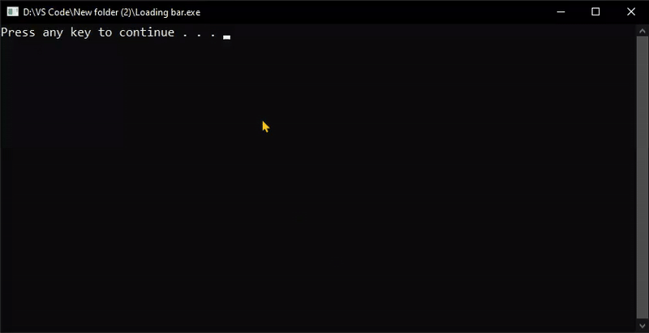

# Responsive Progress Bar in C++

This project showcases a **responsive progress bar** implemented in C++.

## Demo
  

## Usage
1. Compile the `Loading bar.cpp` file:
    ```bash
    g++ "Loading bar.cpp" -o progressbar
    ```

2. Run the executable:
    ```bash
    progressbar.exe
    ```

## File Structure
```
├── README.md
├── Loading bar.cpp
└── demo.gif
```

## License
Licensed under the MIT License.
